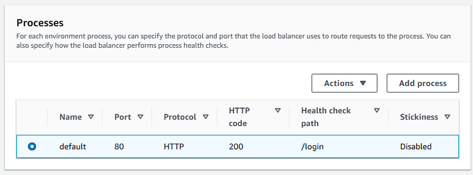
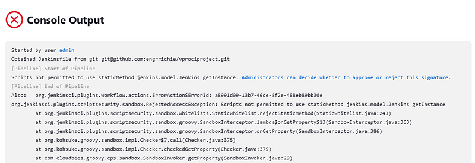
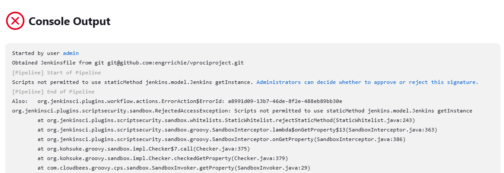

# Project-25: Continuous Delivery Hybrid (Using Ansible & AWS)

[*Project Source*](https://www.udemy.com/course/devopsprojects/learn/lecture/23901740#overview)


-  *This is project is also an extension of previous CI Pipeline (project 24)*
-  *It is called "Hybrid" because jenkins will be used for continuous integration and AWS for PASS and SAS services.*

# TOOLS
* Jenkins for CI server
* Nexus Sona type repo for artifact storage and download.
* Sonarqube server for sonar analysis.
* Maven to build artifact.
* Git as Version control.
* Slack for Notification.
* Beanstalk for deployment using AWS CLI in Jenkins.
* AWS s3 bucket for Artifact upload

# Pre-requisities
* Project-24 Setup

## Step-1: Validate CI Pipeline in Jenkins

- Having our CI pipeline ready in Jenkins server, Let us run it to make sure it works without issues.


- SSH into jenkins server and install awscli
```sh
sudo apt update
sudo apt install awscli -y
```

## Step-2: Setup S3, IAM and Beanstalk in AWS

# Creating IAM user for Elastic Beanstalk
- The IAM user will be used with AWS CLI. It needs to access to S3 to download the artifact, it also need to access Beanstalk environment to upload the latest artifact from S3 bucket.
- Download the csv credentials.
```sh
Name: cicd-bean
Policies:
* AmazonS3FullAccess
* AdministratorAccess-AWSElasticBeanstalk
```
# Create Credentials in Jenkins for Beanstalk IAM user
- Create a global credentials with the properties below.
```sh
Kind: AWS Credentials
ID: awsbeancreds
Description: awsbeancreds
AccessKeyID
Secret Access Key
```
* Create an S3 bucket for Beanstalk
- Create an S3 bucket with a unique name `vprocicdbean25`
* Create Beanstalk application
- Create an application in Beanstalk with the properties below.
```sh
Name: vproapp
Platform: Tomcat
Custom configuration
##Capacity:
- Load Balanced
- Min: 2
- Max: 4
InstanceType: t2.micro
##  Rolling updates and deployments
- Policy: Rolling
- 50 %
```

## Step-3: Pipeline Setup for Staging

- Create Jenkinsfile in repository
- Go to `vprofileciproject` repository in local. Create a new branch and make updates in Jenkinsfile from ci-pipeline.
```sh
git checkout ci-jenkins
git checkout -b cicd-jenbean-stage
code .
```

- Add few variables and a new stage to deploy artifact to Beanstalk environment using `awscli` commands.
```sh
## Variables to add ###
ARTIFACT_NAME = "vprofile-v${BUILD_ID}.war"
AWS_S3_BUCKET = 'vprocicdbean'
AWS_EB_APP_NAME = 'vproapp'
AWS_EB_ENVIRONMENT = 'Vproapp-env'
AWS_EB_APP_VERSION = "${BUILD_ID}"
### New stage to deploy beanstalk##
stage('Deploy to Stage Bean'){
          steps {
            withAWS(credentials: 'awsbeancreds', region: 'us-west-1') {
               sh 'aws s3 cp ./target/vprofile-v2.war s3://$AWS_S3_BUCKET/$ARTIFACT_NAME'
               sh 'aws elasticbeanstalk create-application-version --application-name $AWS_EB_APP_NAME --version-label $AWS_EB_APP_VERSION --source-bundle S3Bucket=$AWS_S3_BUCKET,S3Key=$ARTIFACT_NAME'
               sh 'aws elasticbeanstalk update-environment --application-name $AWS_EB_APP_NAME --environment-name $AWS_EB_ENVIRONMENT --version-label $AWS_EB_APP_VERSION'
            }
          }
        }
```
- After the updates, commit/push to repository.
- Before deployment, change Health check path in Beanstalk application config settings. The application is being stable at `/login` path.


* Create Pipeline in Jenkins
- Create a pipeline with the properties below.
```sh
Name: cicd-jenkins-bean-stage
Kind: pipeline
Pipeline from SCM
SSH GitHub URL
githublogin credentials
Branch: */cicd-jenbean-stage
```
- Run the pipeline.


## Step-4: Pipeline Setup for Prod
* Create Production environment in Beanstalk
- Create a new environment for production in Beanstalk.
```sh
Webserver environment
Name: Vproapp-prod-env
Domain: Vproapp-prod-env
Platform: Tomcat 
Sample Application
Custom configuration
##Capacity:
- Load Balanced
- Min: 2
- Max: 4
InstanceType: t2.micro
##  Rolling updates and deployments
- Policy: Rolling
- 50 %
```

- Once environment is stable, update Health check path to /login as we did in previous steps, then apply changes.

# Create Jenkinsfile in repository
- Go to `vprofileciproject` repository in local. Create a new branch and make updates in Jenkinsfile from ci-pipeline.
```sh
git checkout -b cicd-jenbean-prod
``` 
- To enable the artifact uploaded to beanstalk stage environment deployed to prod environment, add a login in Jenkinsfile to achieve the same.
 Jenkinsfile for Production deployment
```sh
def buildNumber = Jenkins.instance.getItem('cicd-jenkins-bean-stage').lastSuccessfulBuild.number
```
```sh
def COLOR_MAP = [
    'SUCCESS' : 'good',
    'FAILURE' : 'danger'
]pipeline {
    agent any
    tools {
        maven "MAVEN3"
        jdk "OracleJDK8"
    }    environment {
        SNAP_REPO = 'vprofile-snapshot'
        NEXUS_USER = 'admin'
        NEXUS_PASS = 'admin'
        RELEASE_REPO = 'vprofile-release'
        CENTRAL_REPO = 'vpro-maven-central'
        NEXUSIP = '172.31.12.154'
        NEXUSPORT = '8081'
        NEXUS_GRP_REPO = 'vpro-maven-group'
        NEXUS_LOGIN = 'nexuslogin'
        SONARSERVER = 'sonarserver'
        SONARSCANNER = 'sonarscanner'
        ARTIFACT_NAME = "vprofile-v${buildNumber}.war"
        AWS_S3_BUCKET = 'vprocicdbean-rd'
        AWS_EB_APP_NAME = 'vproapp'
        AWS_EB_ENVIRONMENT = 'Vproapp-prod-env'
        AWS_EB_APP_VERSION = "${buildNumber}"
    }
    
    stages{
        stage('DEPLOY to Prod BEAN'){
                steps {
                    withAWS(credentials: 'awsbeancreds', region: 'us-east-1') {
                    sh 'aws elasticbeanstalk update-environment --application-name $AWS_EB_APP_NAME --environment-name $AWS_EB_ENVIRONMENT --version-label $AWS_EB_APP_VERSION'
                    }
                }
            }
   }
   
    post{
        always {
            echo 'Slack Notifications'
            slackSend channel: '#jenkinscicd',
                color: COLOR_MAP[currentBuild.currentResult],
                message: "*${currentBuild.currentResult}:* Job ${env.JOB_NAME} build ${env.BUILD_NUMBER} \n More info at: ${env.BUILD_URL}"
        }
    }
}
```

- Commit/push the changes in GitHub.

* Create Pipeline in Jenkins
- Create a pipeline with below properties.
```sh
Name: cicd-jenkins-bean-prod
Kind: pipeline
Copy from: cicd-jenkins-bean-stage
branch: */cicd-jenbean-prod
```
- Run the pipeline. 
- It failed with error message below, and this is because i am trying to fetch the build id from another pipeline.


- Right click on blue error and Open in new tab to approve it, this should be done repeatedly after build failure. After 5th or 6th time, the pipeline should run successfully



## Step-5: CICD Flow

- Developers make code changes to staging environment. Once it is pushed to GitHub `CI/CD Stage pipeline` will be triggered. 
- After few approvals, staging branch will be merged to production branch. This will trigger `CI/CD Prod pipeline`.

```sh
git checkout cicd-jenbean-stage
git checkout cicd-jenbean-prod
git merge cicd-jenbean-stage
git push origin cicd-jenbean-prod
```


- We will get notifications from `Slack`.


## Step-6: Clean-up
- Clean Up resources